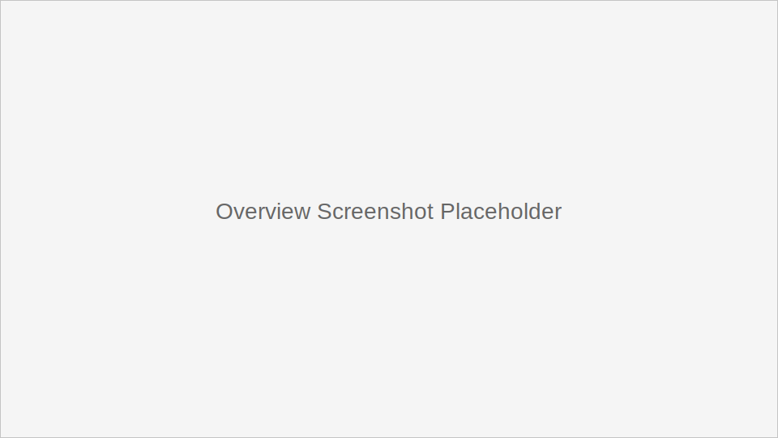
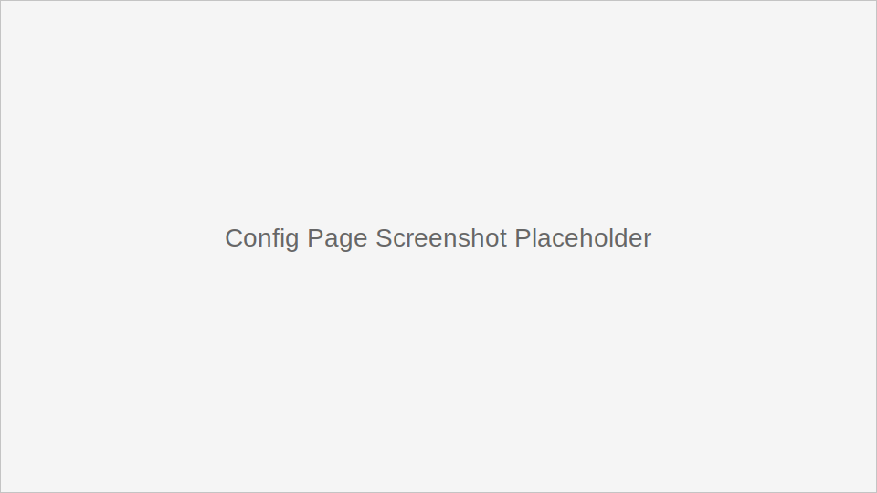
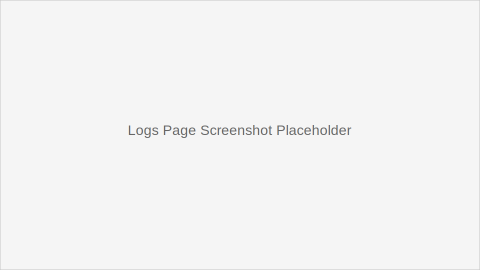
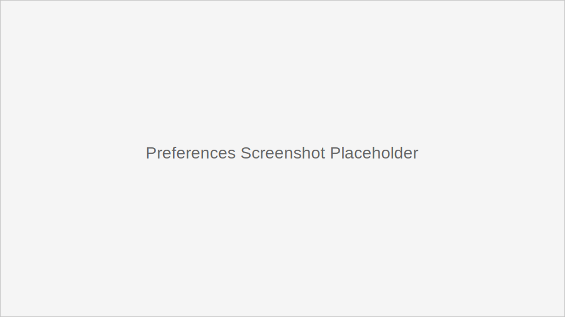

# SwiFRP

> **中文优先**：SwiFRP 是 [frpmgr](https://github.com/koho/frpmgr) 的 macOS 原生移植版，用 SwiftUI + MVVM 打造图形化 FRP 客户端管理工具。
>
> **English**: SwiFRP is a macOS-native port of [frpmgr](https://github.com/koho/frpmgr), providing a SwiftUI + MVVM GUI for managing FRP client configurations.

## 简介 / Overview

SwiFRP 旨在为 macOS 用户提供与 Windows 版 frpmgr 等价的 FRP 客户端管理体验，包括配置管理、代理管理、日志查看和偏好设置等。

SwiFRP brings feature parity with the Windows frpmgr experience on macOS, covering configuration management, proxy control, log viewing, and preferences.

## 功能特性 / Features

- 配置管理：支持新建、编辑、复制、导入与导出（INI/TOML）。
- 代理管理：按配置维护代理条目，提供便捷的启停控制。
- 日志查看：按配置与日期查看日志，支持自动刷新与打开日志目录。
- 偏好设置：多语言、主密码、更新检查与高级选项。
- 启动与守护：通过 launchd 管理 frpc 后台进程。

- Configuration management: create, edit, duplicate, import, and export (INI/TOML).
- Proxy management: manage proxy entries per configuration with start/stop controls.
- Log viewer: filter by config/date with auto-refresh and quick folder access.
- Preferences: language, master password, update checks, and advanced options.
- Launchd integration for background frpc management.

## 系统要求 / Requirements

- macOS 13.0 (Ventura) 或更高版本
- Swift 5.9+（开发/构建）
- 已安装 `frpc` 二进制文件（可放置于 `/usr/local/bin`、`/opt/homebrew/bin` 或打包进应用）

- macOS 13.0 (Ventura) or later
- Swift 5.9+ (for development/build)
- `frpc` binary available (e.g. `/usr/local/bin`, `/opt/homebrew/bin`, or bundled)

## 部署与安装 / Deployment & Installation

### 1) 准备 frpc

- 从 [frp releases](https://github.com/fatedier/frp/releases) 下载并放置 `frpc` 到常见路径。
- 或使用 Homebrew 安装：`brew install frp`

- Download `frpc` from [frp releases](https://github.com/fatedier/frp/releases) and place it in a common path.
- Or install via Homebrew: `brew install frp`

### 2) 构建应用

```bash
swift build -c debug
./package.sh
```

构建完成后会生成 `SwiFRP.app`：

```bash
open SwiFRP.app
```

可直接使用脚本打开应用：

```bash
./package.sh --open
```

Build steps (same as above):

```bash
swift build -c debug
./package.sh
open SwiFRP.app
```

## 使用指南 / Usage

1. 打开应用后，在“配置”页创建或导入配置（INI/TOML）。
2. 选择配置并启动/停止 frpc 实例。
3. 在“日志”页查看运行日志，或打开日志目录进行排查。
4. 在“偏好设置”中切换语言、设置主密码与高级选项。

1. Create/import configs (INI/TOML) in the Configuration tab.
2. Start/stop frpc instances for the selected config.
3. Use the Logs tab to inspect runtime logs or open the log folder.
4. Adjust language, master password, and advanced options in Preferences.

## 技术说明 / Technical Notes

- **架构**：SwiftUI + MVVM（`Models/Views/ViewModels` 目录）。
- **进程管理**：使用 `launchd` 管理后台 frpc 进程。
- **配置解析**：内置 TOML/INI 解析与转换模块。
- **国际化**：内置多语言资源（简体中文、繁体中文、英文、日语、韩语、西语）。

- **Architecture**: SwiftUI + MVVM (`Models/Views/ViewModels`).
- **Process management**: launchd-managed frpc services.
- **Config parsing**: built-in TOML/INI parsing and conversion.
- **Localization**: built-in strings for multiple locales.

## 目录结构 / Project Layout

```
SwiFRP/
├── SwiFRP/            # 应用源码
├── SwiFRPTests/       # 单元测试
├── package.sh         # 打包脚本
└── claude.md          # 功能规格（中文）
```

```
SwiFRP/
├── SwiFRP/            # App sources
├── SwiFRPTests/       # Unit tests
├── package.sh         # Packaging script
└── claude.md          # Specification (Chinese)
```

## 截图 / Screenshots

> 以下为截图占位符，欢迎补充真实截图。

- 总览 / Overview

  

- 配置页 / Configuration

  

- 日志页 / Logs

  

- 偏好设置 / Preferences

  

## 开发与测试 / Development & Testing

```bash
swift build -c debug
swift test
```

> 注意：测试需在 macOS 环境执行（依赖 AppKit）。

```bash
swift build -c debug
swift test
```

> Note: tests must run on macOS due to AppKit dependencies.

## 开源规范 / Open Source

- 许可证：见 [LICENSE](LICENSE)
- 贡献指南：见 [CONTRIBUTING.md](CONTRIBUTING.md)
- 行为准则：见 [CODE_OF_CONDUCT.md](CODE_OF_CONDUCT.md)

- License: see [LICENSE](LICENSE)
- Contributing: see [CONTRIBUTING.md](CONTRIBUTING.md)
- Code of Conduct: see [CODE_OF_CONDUCT.md](CODE_OF_CONDUCT.md)

## 相关链接 / Links

- FRP: https://github.com/fatedier/frp
- frpmgr: https://github.com/koho/frpmgr
